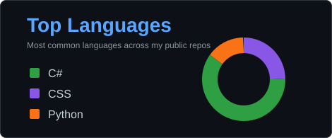

# Hi, I'm Tadeas

I am a student developer focused on C#, .NET, and practical programming projects. I use GitHub to track my progress, improve my code quality, and build a portfolio of small but useful applications.

## What I am working on

- Building console and desktop projects in C#
- Learning cleaner project structure, OOP, and file handling
- Improving my Git and GitHub workflow
- Exploring game development and automation ideas

## Tech I use

## Featured projects

### File Organizer

A C# console application that organizes files into folders by category. It includes path validation, preview before moving files, duplicate filename handling, colored console output, and a clean project structure.

Repository: [FileOrganizer](https://github.com/Missury15/FileOrganizer)

### Other learning projects

I also keep smaller practice projects on my profile, including number games, calculators, console experiments, and early Python projects. These show my learning path and how my code improves over time.

## Current goals

- Write cleaner and more readable C# code
- Build projects that are useful enough to show in a portfolio
- Learn more about software architecture step by step
- Keep improving my README files, commits, and project presentation

## GitHub stats

<table>
  <tr>
    <td valign="top">
      
    </td>
    <td valign="top">
      
    </td>
  </tr>
</table>
